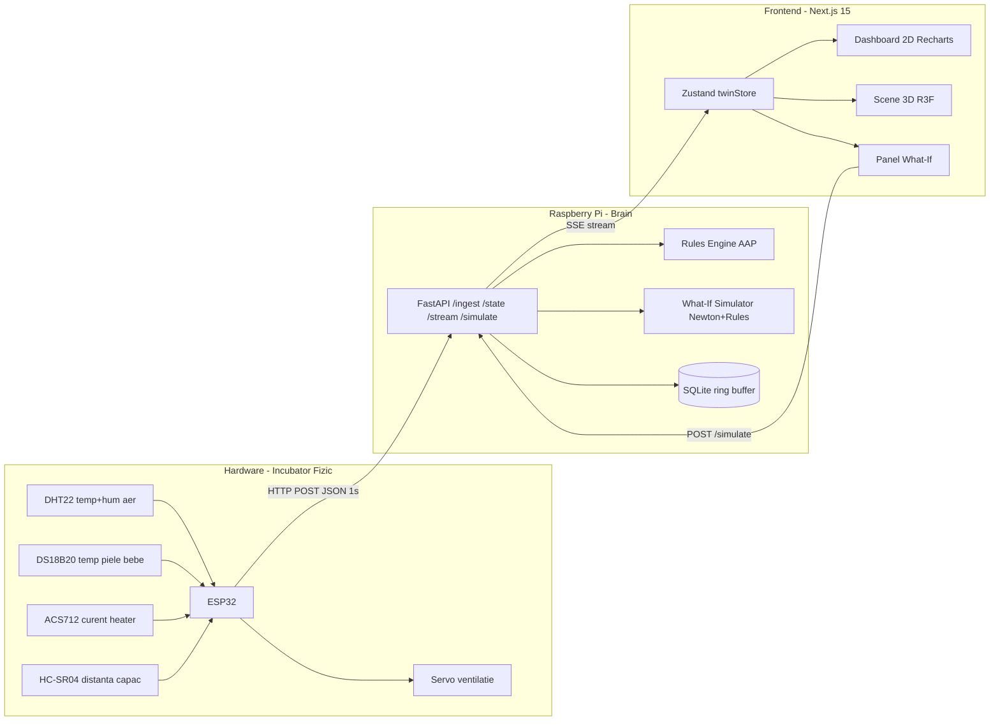

# NeoTwin — Digital Twin pentru Incubator Neonatal
**Hackathon Plan — Architect Mode**

> Un incubator fizic instrumentat (ESP32 + senzori) replicat în timp real într-un geamăn digital 3D care poate răspunde la întrebarea **„ce s-ar întâmpla dacă?”** prin simulare bazată pe reguli clinice AAP (American Academy of Pediatrics).

---

## 1. Vision & Narativ pentru Juriu

**Problema reală**: În terapie intensivă neonatală (NICU), o schimbare de 1–2°C în câteva minute poate fi fatală. Personalul medical reacționează **la alarmă**, nu **la predicție**.

**Soluția NeoTwin**: Geamăn digital care nu doar vizualizează starea curentă, ci **simulează viitorul** (1/5/15 min) și **scenarii contrafactuale** („dacă se strică încălzitorul acum, în cât timp bebelul intră în hipotermie?”).

**Valoarea digital twin** = nu e doar dashboard, e un **model fizic + clinic** care rulează în paralel cu realitatea.

---

## 2. Arhitectura Sistemului



**De ce această arhitectură**:
- ESP32 face **doar** achiziție + POST (zero logică, zero crash risk).
- Raspberry Pi e **sursa de adevăr** (persistă istoric, aplică reguli, rulează simulator).
- Next.js e **pur prezentare** (SSR + SSE, GPU-ul mașinii de dev pentru R3F).
- Decuplare totală → putem demo-a **fără ESP32** prin mock mode.

---

## 3. Mapping Senzori → Semnificație Clinică

| Senzor | Rol fizic | Rol în digital twin | Prag AAP |
|---|---|---|---|
| DHT22 (×1) | Temp + umiditate aer incubator | Mediu ambiental | Temp 32–37°C, Hum 50–60% |
| DS18B20 (×1, waterproof) | Temp „piele” bebe (simulăm cu un obiect cald) | Temp corp neonatal | **36.5–37.5°C** (normotermie) |
| ACS712 | Curent consumat de încălzitor (o rezistență / bec) | Detectează dacă heater-ul e funcțional | >0.1 A = activ |
| HC-SR04 | Distanță la capac | Detectează capac deschis (pierdere termică) | <5 cm = închis |
| Servo SG90 | Controlează o clapă de ventilație | Actuator pentru răcire | 0°=închis, 90°=deschis |

> **Trucul pentru demo**: „bebelul” = un balon cu apă caldă sau o sticlă, cu DS18B20 lipit pe el. Arată convingător în 3D.

---

## 4. Dataset Sintetic — Reguli Clinice AAP

Fișier: [`data/clinical-rules.json`](data/clinical-rules.json:1)

```json
{
  "version": "AAP-2022-simplified",
  "bodyTemperature": {
    "severeHypothermia": { "max": 32.0, "severity": "critical" },
    "moderateHypothermia": { "min": 32.0, "max": 36.0, "severity": "alert" },
    "mildHypothermia":    { "min": 36.0, "max": 36.5, "severity": "watch" },
    "normothermia":       { "min": 36.5, "max": 37.5, "severity": "normal" },
    "hyperthermia":       { "min": 37.5, "max": 38.5, "severity": "alert" },
    "severeHyperthermia": { "min": 38.5, "severity": "critical" }
  },
  "airTemperature":    { "min": 32.0, "max": 37.0 },
  "humidity":          { "min": 50.0, "max": 60.0 },
  "timeToDamage": {
    "hyperthermia":  { "thresholdC": 38.5, "minutesToRisk": 10 },
    "hypothermia":   { "thresholdC": 36.0, "minutesToRisk": 15 },
    "lidOpen":       { "maxSeconds": 30 }
  },
  "physics": {
    "newtonCoolingK": 0.08,
    "babyMassKg": 3.2,
    "specificHeatJkgK": 3470,
    "heaterPowerW": 80
  }
}
```

> Sursă: AAP Clinical Report „Temperature Measurement in Preterm Infants”. Valorile sunt **simplificate educațional** — la pitch spunem clar „simulare hackathon, nu dispozitiv medical”.

---

## 5. Modelul Fizic pentru Simulare

**Newton’s law of cooling** adaptat:
```
dT_baby/dt = k * (T_air - T_baby) + Q_heater / (m * c)
```
Unde:
- `k` = coeficient transfer termic (0.08 /min în incubator închis, 0.25 cu capacul deschis).
- `Q_heater` = putere efectivă (0 dacă curent < prag).
- `m, c` = masa și căldura specifică a bebelușului.

Integrare Euler discret (dt = 1s) → predicție pe 1/5/15 min.
**What-if** = reluăm integrarea cu parametri modificați de utilizator.

---

## 6. Scenarii „Ce s-ar întâmpla dacă?” (Preseturi)

| Scenariu | Override aplicat | Așteptat în 5 min |
|---|---|---|
| 🔥 **Hipertermie bruscă** | T_air forțat la 40°C | T_baby → ~38.2°C, alert |
| ❄️ **Heater defect** | Q_heater = 0 | T_baby scade ~0.5°C/min |
| 🚪 **Capac deschis 30s** | k = 0.25 pe 30s | Drop ~1°C, revenire lentă |
| 🔌 **Senzor defect** | DS18B20 returnează 0/NaN | Trigger failover la predicție |
| 💨 **Ventilație blocată** | servo=90° dar hum crește | Detectare anomalie |

---

## 7. Schema API (FastAPI)

| Metodă | Endpoint | Payload | Scop |
|---|---|---|---|
| POST | [`/ingest`](:1) | `SensorReading` | ESP32 trimite măsurători |
| GET  | [`/state`](:1) | — | Ultima stare + clasificare |
| GET  | [`/history?seconds=60`](:1) | — | Buffer istoric pentru grafice |
| GET  | [`/stream`](:1) | — | Server-Sent Events live |
| POST | [`/simulate`](:1) | `WhatIfRequest` | Rulează scenariu, întoarce traiectorie |
| GET  | [`/rules`](:1) | — | Returnează dataset clinic (pt UI) |

**Tipuri de date** (TS + Pydantic mirror):
```ts
type SensorReading = {
  ts: number;
  airTempC: number;
  humidityPct: number;
  babySkinTempC: number;
  heaterCurrentA: number;
  lidDistanceCm: number;
  servoAngleDeg: number;
};

type Severity = "normal" | "watch" | "alert" | "critical";

type TwinState = {
  reading: SensorReading;
  severity: Severity;
  activeRules: string[];          // ex: ["hyperthermia", "lidOpen"]
  prediction: { t1: number; t5: number; t15: number };
};

type WhatIfRequest = {
  overrides: Partial<SensorReading>;
  horizonSec: number;             // 60, 300, 900
  preset?: "hyperthermia" | "heaterFail" | "lidOpen" | "sensorFail";
};
```

---

## 8. Stack Tehnic (conform EcoRoute DNA)

**Frontend** (`/apps/web`):
- Next.js 15 App Router, TypeScript strict, Tailwind, Shadcn/UI
- `@react-three/fiber` + `@react-three/drei` (3D)
- `recharts` (grafice)
- `zustand` (twin store)
- `lucide-react` (iconuri)

**Backend** (`/apps/pi`):
- Python 3.11, FastAPI, Uvicorn, Pydantic v2
- SQLite + `sqlite3` (fără ORM — keep it fast)
- `sse-starlette` pentru streaming

**Firmware** (`/apps/esp32`):
- PlatformIO, framework Arduino
- `DHT sensor library`, `OneWire`, `DallasTemperature`, `ESP32Servo`

**Mono-repo**: pnpm workspaces + un `Makefile` top-level cu `make dev`, `make demo`, `make flash`.

---

## 9. Structură Directoare Propusă

```
/apps
  /web                 Next.js 15
    /app
      /page.tsx        Dashboard principal
      /twin/page.tsx   Vedere 3D full
      /whatif/page.tsx Simulator
    /components
      /sensors         SensorCard, SensorGrid
      /twin            IncubatorScene, Baby3D, HeatGradient
      /whatif          ScenarioPicker, PredictionTimeline
    /lib
      /api.ts          fetch wrappers
      /sse.ts          EventSource hook
      /types.ts        SensorReading, TwinState
    /hooks
      /use-twin-stream.ts
      /use-what-if.ts
    /store
      /twin-store.ts   Zustand
  /pi                  FastAPI
    /app
      main.py
      routes/
      rules_engine.py
      simulator.py
      models.py        Pydantic
      db.py
    /data
      clinical-rules.json
      seed-history.jsonl  pentru demo mode
  /esp32               PlatformIO
    /src/main.cpp
    platformio.ini
/plans                 acest fisier
/docs                  diagrame, poze hardware
Makefile
pnpm-workspace.yaml
```

---

## 10. Ordinea de Atac (critic pentru hackathon)

```mermaid
gantt
    title Prioritizare hackathon
    dateFormat X
    axisFormat %s
    section MUST (demo viabil)
    Setup repo + FastAPI mock       :a1, 0, 2
    Dataset + rules engine          :a2, after a1, 2
    Dashboard 2D + SSE + mock data  :a3, after a2, 3
    What-If preseturi + simulator   :a4, after a3, 3
    section SHOULD (wow factor)
    ESP32 real integration          :b1, after a2, 4
    Scene 3D R3F basic              :b2, after a3, 4
    section NICE (polish)
    Shaders + particule             :c1, after b2, 2
    Dark theme + toasts             :c2, after a4, 2
```



> **Regulă de aur**: până la jumătatea hackathon-ului trebuie să avem **DEMO MODE** funcțional fără ESP32. Hardware-ul se integrează paralel — dacă pică, nu ne oprim.

---

## 11. Sugestii & Capcane de Evitat

1. **Mock-first**: scrie întâi un `seed-history.jsonl` cu 5 minute de date realiste și un endpoint `/ingest-mock` care le redă. Frontend-ul nu știe diferența.
2. **Un singur senzor „eroic”**: DS18B20 pe bebeluș e vedeta. Dacă toate celelalte pică, povestea „temp bebe + predicție 15 min” singură câștigă.
3. **SSE > WebSocket**: mai simplu, auto-reconnect nativ, merge prin CORS fără drame.
4. **Ring buffer în memorie** pentru ultimele 300s — nu lovi SQLite la fiecare read.
5. **Ceas NTP pe ESP32**: timestamp-urile trebuie sincronizate cu Pi-ul altfel graficele sar.
6. **3D = boxă + sferă + cilindru**: nu pierde timp cu modele GLTF. Geometrii primitive + lumini + gradient = arată profi în R3F.
7. **„Digital twin” ≠ „dashboard”**: la pitch **arată split-screen real vs simulat**. Acolo e diferența.
8. **Alertă emoțională**: când severity = critical → toast roșu + sunet scurt + border pulsant pe 3D. Juriul ține minte.
9. **Calibrare ACS712**: offset-ul la 0A variază. Fă o rutină `calibrate()` la boot.
10. **Fallback senzor defect**: dacă `DS18B20` returnează -127 (disconnect), folosește predicția ca valoare afișată + badge „ESTIMATED”. Asta **este** digital twin-ul în acțiune.

---

## 12. Demo Script (3 min pitch)

1. **0:00** — Arată incubatorul fizic, capacul închis, dashboard-ul verde „normal”.
2. **0:30** — Deschide capacul → ultrasonic detectează → badge „watch” → 3D: flux aer albastru scăpând.
3. **1:00** — Închide capacul. Click „What-If: Heater Fail”. Timeline arată temp bebe scăzând sub 36°C în 4 min.
4. **1:45** — Scoate heater-ul real (decuplează) → ACS712 = 0 → sistemul **detectează de la sine** scenariul prezis. **„Am prevăzut asta acum 1 minut.”**
5. **2:30** — Arată că sistemul rulează pe Raspberry Pi, ESP32 izolat, frontend pe orice device. Scalabil la N incubatoare.
6. **2:55** — Close: „NeoTwin nu afișează trecutul. Prezice viitorul.”

---

## 13. Definition of Done (MVP)

- [ ] ESP32 trimite ≥3 senzori reali la Pi la 1 Hz.
- [ ] Pi clasifică starea corect pe 4 niveluri de severitate.
- [ ] Dashboard 2D afișează live + istoric 60s.
- [ ] Scene 3D se colorează în funcție de temperatură.
- [ ] Minim 3 preseturi what-if funcționează și arată traiectorie predictivă.
- [ ] Demo mode rulează fără hardware.
- [ ] README cu o comandă `make demo` care pornește tot.
